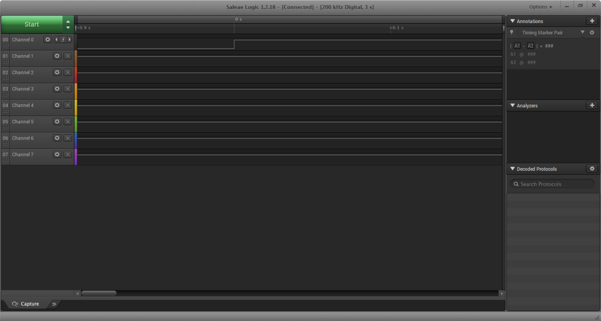
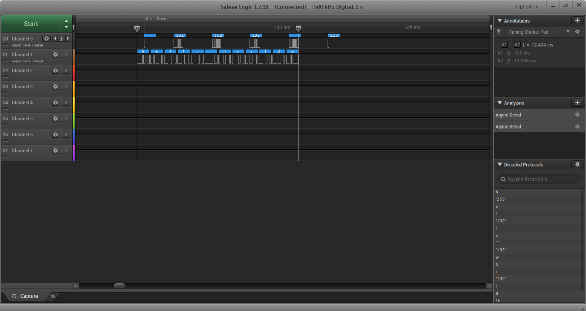
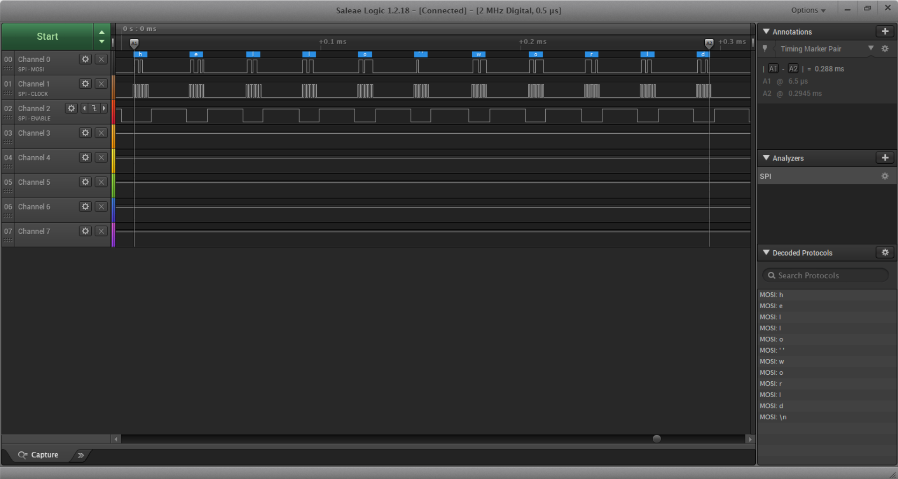

Name: Angela Chan

EID: ac74772

Team Number: ?

## Questions

1. Why does your program need a setup and a loop?

    The program need a setup to start and the loop to let the program run infinitely (as an embedded system).

2. What is the downside to putting all your code in a loop?

    The downside is that it will be harder to tell what the program is doing as there are too many lines in the loop.

3. Why does your code need to be compiled?

    Your code need to be compiled to be translated to the machine language.

4. When lowering the frequency in procedure A, step 4, what is going wrong? Brainstorm some solutions. Dimmers exist in the real world. What is their solution?

    When lowering the frequency, there are the LED is turning on and off at a slower speed and this allows human to see the switching on and off. A solution to this is...

5. Why do you need to connect the logic analyzer ground to the ESP32 ground?

    This way the logic analyzer and the output(with the program loaded) shares the same ground.

6. What is the difference between synchronous and asynchronous communication?

    your answer here

7. Profile of UART: Sent X bytes in Y time 

    your answer here

8. Profile of SPI: Sent X bytes in Y time

    your answer here

9. Why is SPI so much faster than UART?

    your answer here

10. list one pro and one con of UART

    your answer here

11. list one pro and one con of SPI

    your answer here

12. list one pro and one con of I2C

    your answer here

13. Why does I2C need external resistors to work?

    your answer here

## Screenshots

Procedure A, step 1:

Procedure A, step 4:

Procedure B, UART:

Procedure B, SPI:

