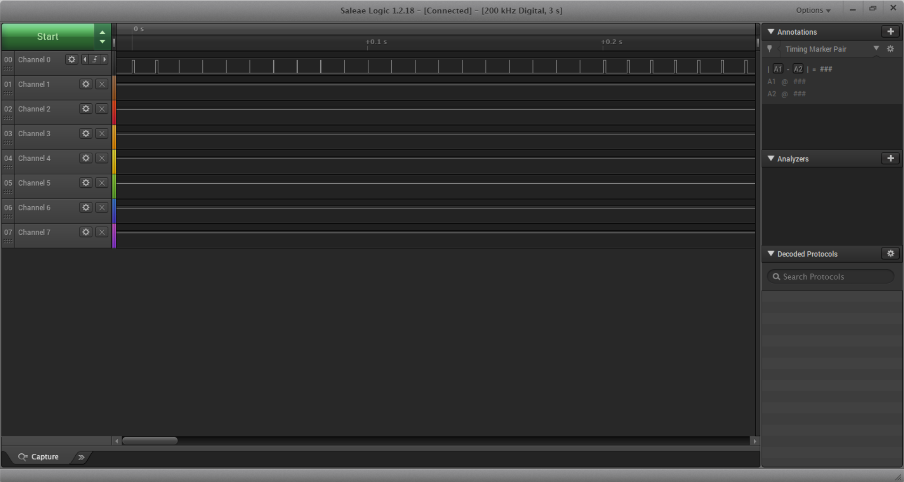

Name: Angela Chan

EID: ac74772

Team Number: 15 (I created it on my own on canvas, IDK is that is okay??)

## Questions

1. Why does your program need a setup and a loop?

    The two functions setup() and loop() are the required functions for every Arduino sketc. The setup is for initialization tasks and the loop is for calling functions and will be repeated over and over (it is the heart of the sketch).

2. What is the downside to putting all your code in a loop?

    The downside is that it will be harder to tell what the program is doing as there are too many lines in the loop.

3. Why does your code need to be compiled?

    Your code need to be compiled to be translated to the machine language.

4. When lowering the frequency in procedure A, step 4, what is going wrong? Brainstorm some solutions. Dimmers exist in the real world. What is their solution?

    When lowering the frequency, the LED is turning on and off at a slower speed and this allows human to see the toggling. In order to have a dimmer, the frequency of the toggling has to be higher than humans can perceive. 

5. Why do you need to connect the logic analyzer ground to the ESP32 ground?

    This way the logic analyzer and the microcontroller shares the same ground.

6. What is the difference between synchronous and asynchronous communication?

    Synchronous communication means the sender and receiver interact at the same time(instantaneous response/ on the same page) and asynchronous communication doesn't require the receiver to respond immediately(there can be delays). Synchronous communication is more effective as the sender and receiver get information at the same time.

7. Profile of UART: Sent X bytes in Y time 

    12 byte in 12.404 ms

8. Profile of SPI: Sent X bytes in Y time

    12 byte in 0.314 ms

9. Why is SPI so much faster than UART?

    SPI is faster than UART because it is a protocol instead of a hardware that uses synchronous communication instead of asynchronous.

10. list one pro and one con of UART

    One pro for UART is that it can be a circuit integrated on the microcontroller (and it is a serial communication and only require two wires for communication). One con is that the size of the data in the frame is limited(speed is also slower than SPI).

11. list one pro and one con of SPI

    The SPI is good in that it is a very fast and robust synchronous communication protocol; however, it requires more wire.

12. list one pro and one con of I2C

    One pro is that I2C has fewer connections(2 signal wires needed) and on con is that it requires hardware to test out the communication signals and that the open-collector design limits slew rate and slew rate is affected by line capacitance.

13. Why does I2C need external resistors to work?

    I2C needs external pull up resistors because the I2C bus drivers are open drain(can pull signal line low, but cannot drive it high), so the pull up resistors are needed to restore the signal to high when no device is asserting it low.

## Screenshots

Procedure A, step 1:

Procedure A, step 4:

Procedure B, UART:

Procedure B, SPI:

